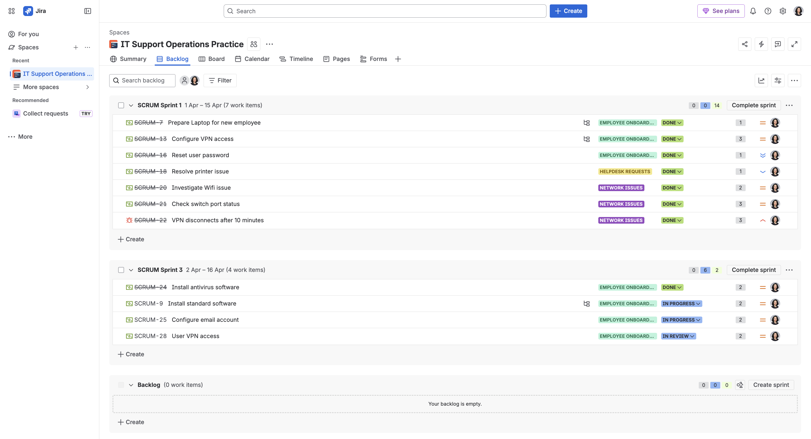
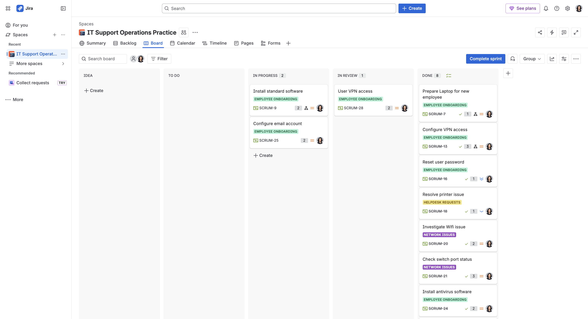
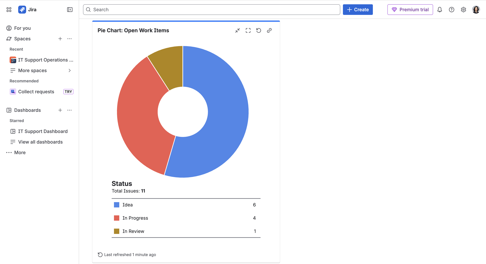
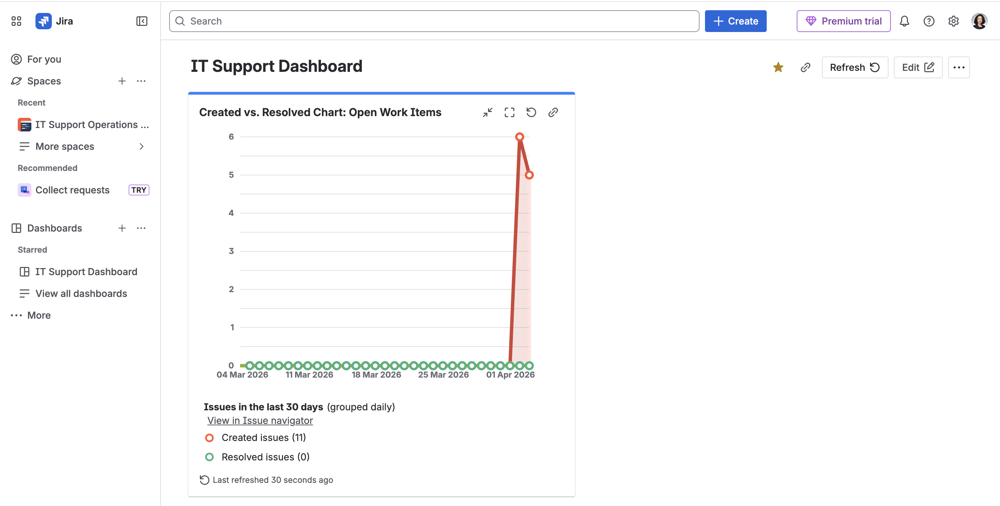
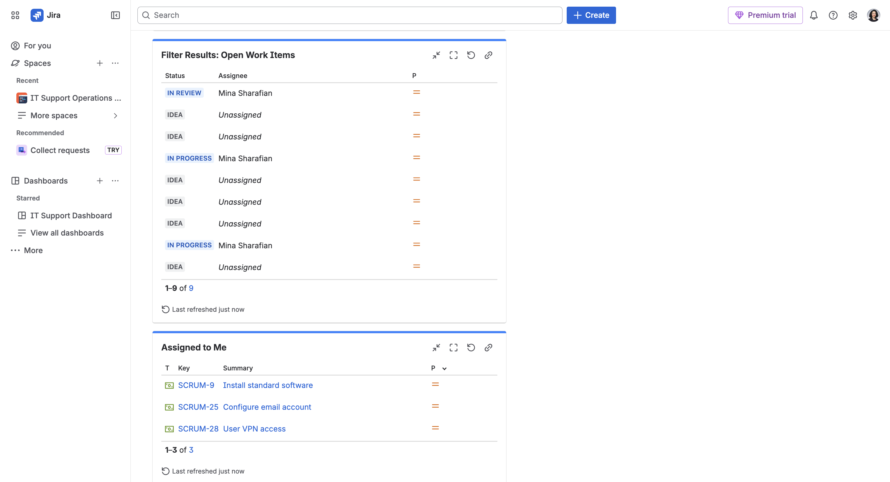

# Jira Agile IT Support Project

This project demonstrates how I used Jira to manage IT support tasks using Scrum methodology.

---

## 🔧 Project Overview

- Managed IT support tasks using Jira Scrum board  
- Created Epics, User Stories, and Sub-tasks  
- Planned and executed Sprints  
- Tracked task progress using workflow (To Do → In Progress → Done)  
- Built Dashboard for monitoring and analysis  

---

## 📋 Backlog & Sprint Planning

---

## 📊 Jira Board (Task Workflow)

---

## 📈 Dashboard & Reporting

  
  

---

## 🚀 Key Skills Demonstrated

- Agile (Scrum) fundamentals  
- Sprint planning and task management  
- Jira workflow management  
- Issue tracking and prioritization  
- Basic reporting and dashboard analysis
